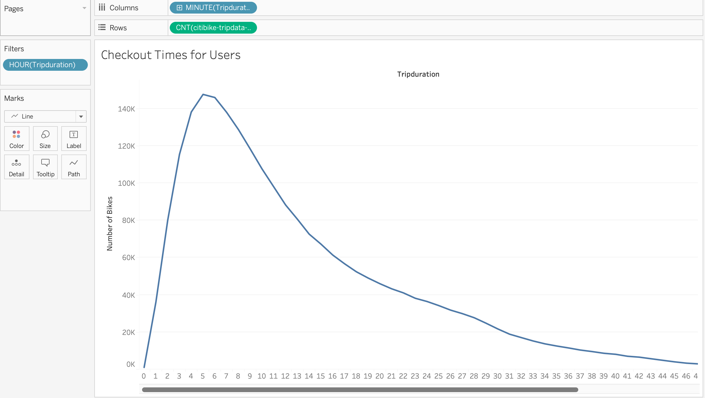
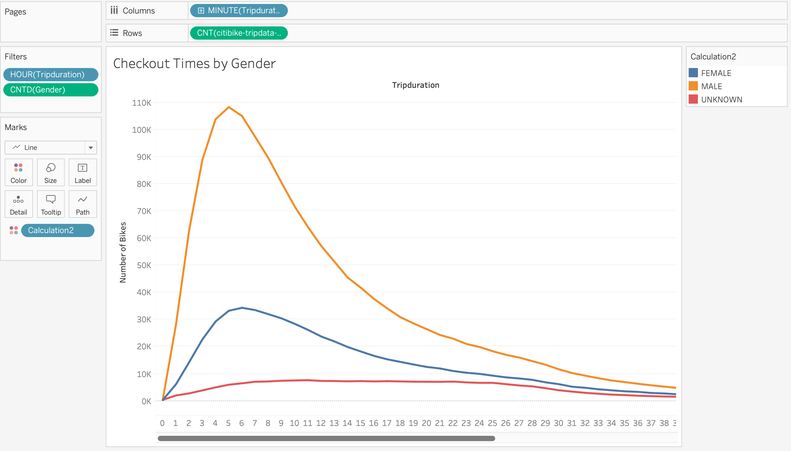
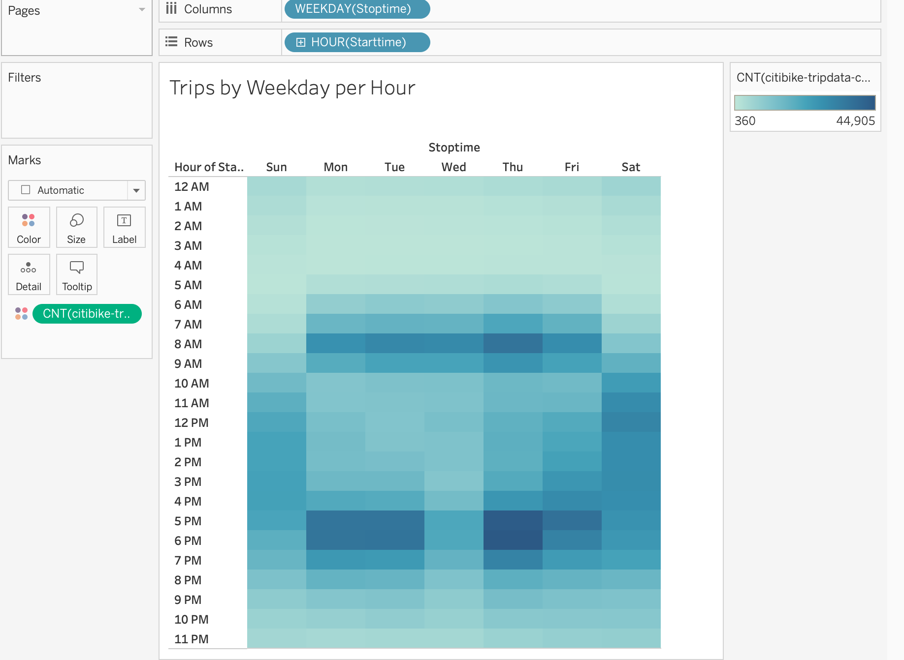
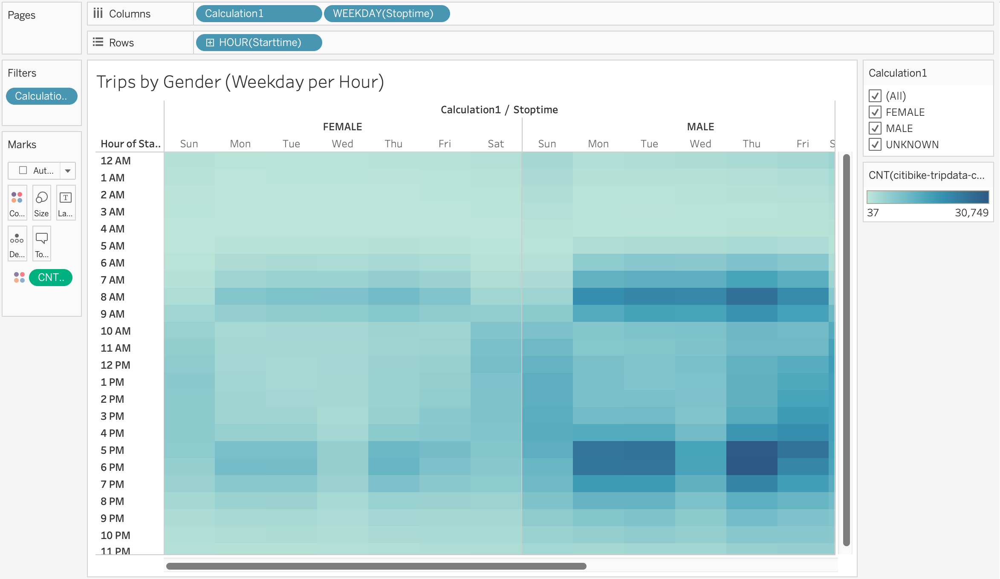
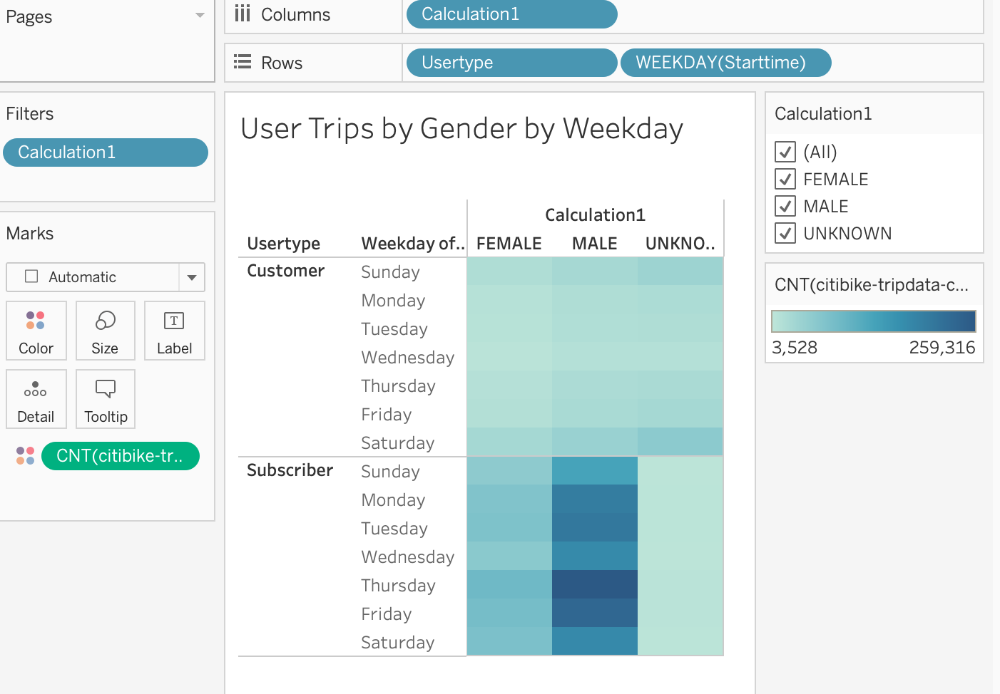
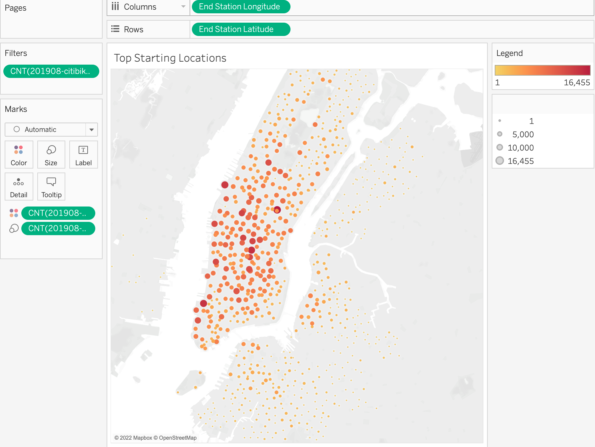
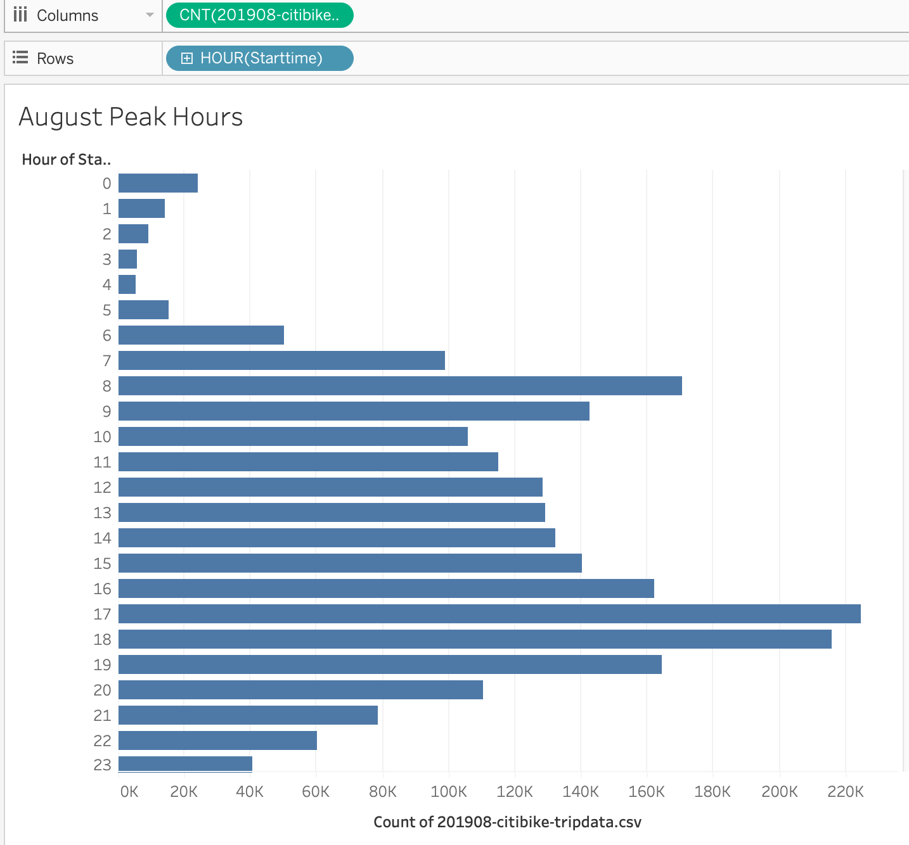

# Bikesharing

The dashboard for the NYC CitiBike Sharing Analysis can be viewed [here](https://public.tableau.com/authoring/NYCCitiBikeAnalysis_16633896856910/NYCCitiBikeAnalysis#1)

## Tools used

• Tableau

• Jupyter Notebook

• Python

## Overview and Purpose

The objective of this project was to collect data on bikesharing services in New York City (NYC) to formulate a comprehensive business strategy for implementing a similar service in Des Moines, Iowa. To accomplish this, we utilized Tableau Public, a powerful data visualization tool, to organize, filter, and visualize the gathered data effectively. The intention behind this approach was to present the necessary information in a clear and understandable manner to business partners and potential investors.

By utilizing Tableau Public, we were able to transform the collected bikesharing data into visually appealing and informative visualizations. These visualizations not only facilitated a better understanding of the data but also provided valuable insights into the operational aspects, user patterns, and market dynamics of bikesharing services in NYC.

## Analysis

The utilization of Tableau Public allowed us to present the gathered data in a compelling and accessible format, enhancing communication with business partners and potential investors. The visual representations facilitated a comprehensive understanding of the key metrics, trends, and potential opportunities associated with bikesharing services, aiding in the formulation of an effective business strategy for the implementation of a similar service in Des Moines, Iowa.

From the data that was processed through Tableau, 7 sheets were chosen to be presented on a Tableau Story with each graph having a summary of the results found. The sheets included data relating to the location where bikesharing was used the most, what times and days are the most popular for people to use bikesharing, and which demographic uses it the most.

The following graphs can be seen here:

## Summary

Based off the graphs that were generated from the data, we can infer many things about the most avid users of the CitiBike bikesharing service. For example, there are many more men who use the service than women. Usage is very high in the mornings and at night when people are commuting to and from work. Because Des Moines is much smaller than New York, it would help if we had some additional visualizations such as average distances traveled per trip and also a separate graph with data on how frequently individual customers used bikesharing services. Because Des Moine is more spread out, people may simply opt to drive. 
