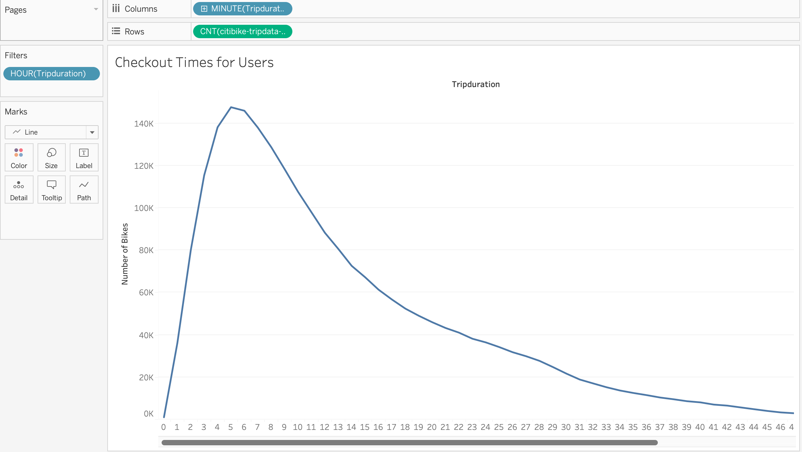
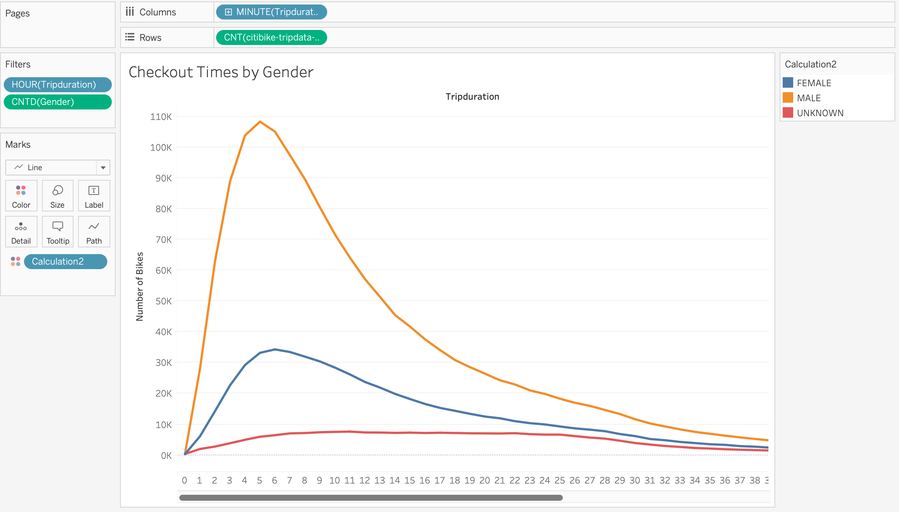
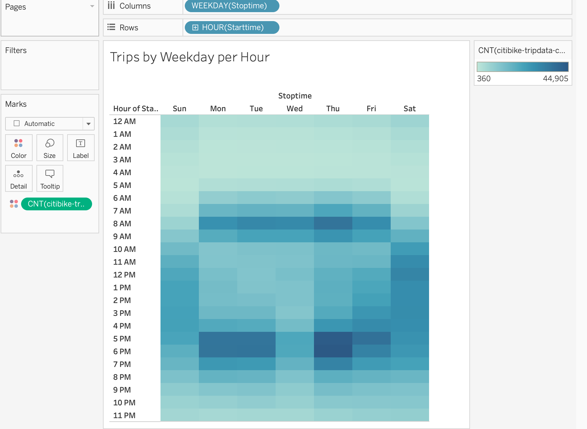
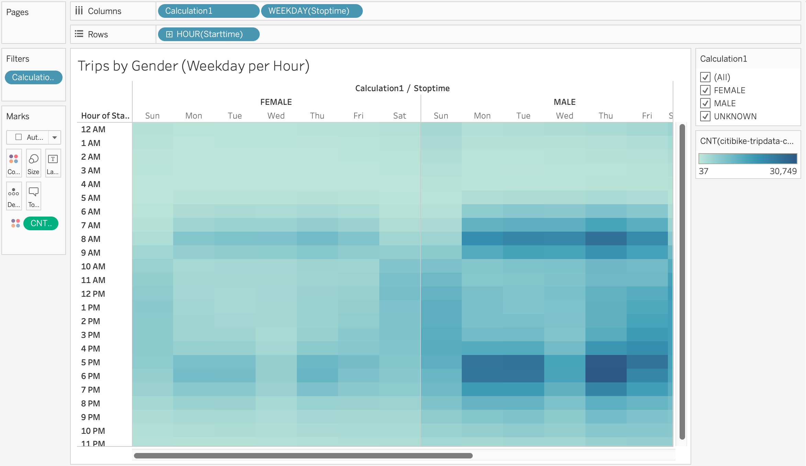
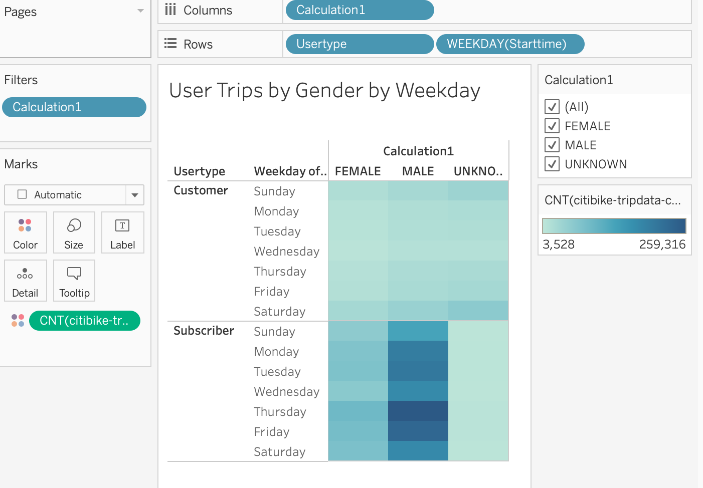
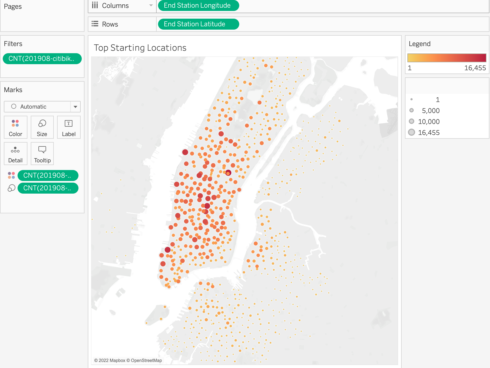
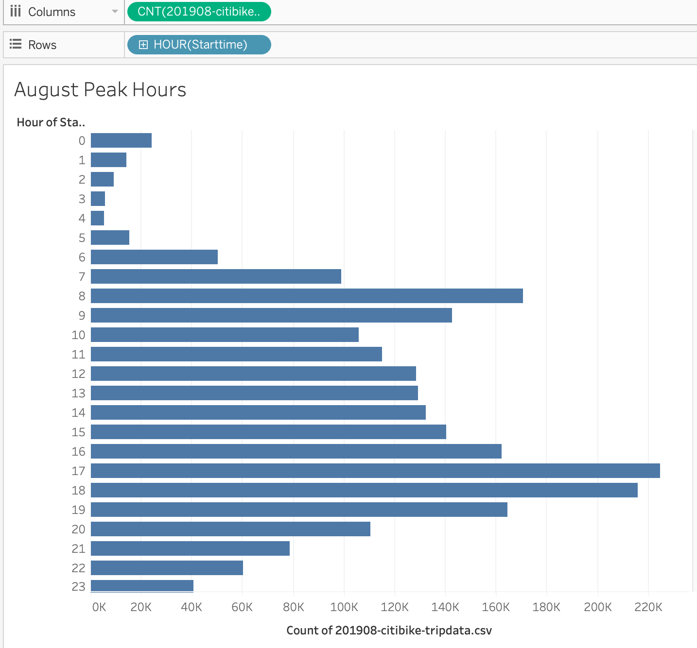

# Bikesharing

The dashboard for the NYC CitiBike Sharing Analysis can be viewed [here]()

## Overview and Purpose

The purpose of this project was to gather data on bikesharing services in NYC so that a comprehensive business strategy could be employed in Des Moines, Iowa. To gather the information necessary, we used Tableau Public to arrange, filter, and visualize the data properly. The reason for doing this is so business partners and potential investors will be able to see and understand the necessary information 

## Analysis

From the data that was processed through Tableau, 7 sheets were chosen to be presented on a Tableau Story with each graph having a summary of the results found. The sheets included data relating to the location where bikesharing was used the most, what times and days are the most popular for people to use bikesharing, and which demographic uses it the most.

The following graphs can be seen here:

## Summary

Based off the graphs that were generated from the data, we can infer many things about the most avid users of the CitiBike bikesharing service. For example, there are many more men who use the service than women. Usage is very high in the mornings and at night when people are commuting to and from work. Because Des Moines is much smaller than New York, it would help if we had some additional visualizations such as average distances traveled per trip and also a separate graph with data on how frequently individual customers used bikesharing services. Because Des Moine is more spread out, people may simply opt to drive. 
